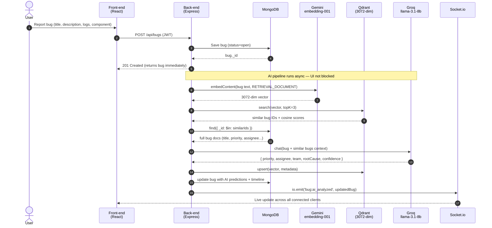

# BugSense

[](https://github.com/s1402/BugSense/actions/workflows/ci.yml)
[](https://github.com/s1402/BugSense/actions/workflows/cd.yml)
[](https://bug-sense.vercel.app)
[](https://bugsense-api.onrender.com/health)

AI-powered bug tracker with RAG-based similarity search, LLM root-cause analysis, and real-time collaboration.

**🌐 Live demo:** [bug-sense.vercel.app](https://bug-sense.vercel.app) · **⚡ API:** [bugsense-api.onrender.com](https://bugsense-api.onrender.com/health)

> **Note:** the API runs on Render's free tier and may cold-start (~30s) on first request. A [keep-warm cron](.github/workflows/keep-warm.yml) pings it every 14 min to keep it hot.

## Features

- **RAG pipeline** — semantic search over past bugs using vector embeddings stored in Qdrant
- **LLM analysis** — **Groq `llama-3.1-8b-instant`** generates root-cause suggestions, priority, and assignee recommendations from retrieved similar bugs
- **Embeddings** — **Google `gemini-embedding-001`** (via `@google/genai`) converts bug text into **3072-dimensional** vectors, with task-specific modes (`RETRIEVAL_DOCUMENT` for indexing, `RETRIEVAL_QUERY` for search)
- **Real-time updates** — Socket.io broadcasts bug create/update/delete events live to all clients
- **Auth** — JWT-based login/register with bcrypt password hashing
- **Hybrid search** — full-text + vector similarity across bug reports

**Stack:** React 19, Vite, React Context, Tailwind v4, Node.js, Express, MongoDB/Mongoose, Qdrant, Socket.io, Groq SDK, Google GenAI, JWT.

## How the RAG works

1. **Indexing** — on bug create/update, the bug's `title + component + description + logs` is embedded via `gemini-embedding-001` with `taskType: RETRIEVAL_DOCUMENT`, then upserted into Qdrant as a 3072-dim vector.
2. **Retrieval** — a user query is embedded with `taskType: RETRIEVAL_QUERY` and cosine-searched against the document vectors. Top-K similar bugs are returned.
3. **Generation** — retrieved bugs are stuffed into a Groq `llama-3.1-8b-instant` prompt to predict priority, suggested assignee, team, and confidence score.

### Why asymmetric embeddings matter

Gemini's embedding API produces **different vectors for documents vs. queries** when given different `taskType` hints. Documents and queries live in different semantic shapes — a bug report (long, detailed) and a search phrase (short, intent-driven) should not be encoded identically. Using `RETRIEVAL_DOCUMENT` when indexing and `RETRIEVAL_QUERY` when searching produces noticeably better top-K recall than using a single symmetric embedding for both sides. This is a RAG best practice that general-purpose embedding models (e.g. OpenAI `text-embedding-3-*`) do not natively expose.

### Sequence diagram — bug creation with full RAG pipeline



**What this shows:**
- The `201 Created` response returns immediately after the bug is saved — the AI pipeline runs in the background, so the user doesn't wait for embeddings + LLM (~2-3s).
- The RAG retrieval is a **two-step lookup**: Qdrant gives semantic neighbors (fast vector search), MongoDB provides the full content for those IDs (LLM needs real context, not just IDs).
- All connected clients see the AI verdict the moment it's ready, via Socket.io broadcast — no polling needed.

## CI / CD

Every change flows through a gated pipeline before reaching production:

```
PR opened ─► CI (lint + test + build) ─► PR merged ─► CD ─► Render (API) + Vercel (UI)
                                                              │
                                                              └─► keep-warm cron every 14 min
```

- **CI** ([ci.yml](.github/workflows/ci.yml)) — path-filtered (only runs jobs for the service that changed), concurrency-cancelled on new pushes, required to merge into main.
- **CD** ([cd.yml](.github/workflows/cd.yml)) — on merge to main, path-filtered deploys: backend via Render deploy hook, frontend via Vercel CLI one-shot deploy. Deploys run in parallel but are serialized per-branch so two merges don't race.
- **Keep-warm** ([keep-warm.yml](.github/workflows/keep-warm.yml)) — cron pings `/health` every 14 min to prevent Render free-tier's 15-min sleep.
- **Branch protection** — main requires PR + green CI, no direct pushes.

## Setup

> **Prefer Docker?** The entire stack (MongoDB + Qdrant + backend + frontend) is containerised — see [DOCKER.md](DOCKER.md) to run it with one command, no Node or databases installed.

### Prerequisites
- Node.js 20+
- MongoDB (local or Atlas)
- Qdrant cloud cluster — [qdrant.tech](https://qdrant.tech)
- API keys: [Groq](https://console.groq.com), [Google AI Studio](https://aistudio.google.com)

### 1. Clone
```bash
git clone https://github.com/s1402/BugSense.git
cd BugSense
```

### 2. Back-end
```bash
cd back-end
npm install
cp .env.example .env    # then fill in your keys
npm run dev             # http://localhost:5000
```
See [back-end/.env.example](back-end/.env.example) for the full list of keys (Mongo, JWT, Qdrant, Groq, Gemini).

### 3. Front-end
```bash
cd front-end
npm install
cp .env.example .env.development
npm run dev             # http://localhost:5173
```
See [front-end/.env.example](front-end/.env.example) for the required Vite env vars.

### 4. (Optional) Seed sample data
```bash
cd back-end && npm run seed
```

## Scripts

| Where      | Command         | Purpose                |
|------------|-----------------|------------------------|
| back-end   | `npm run dev`   | API with nodemon       |
| back-end   | `npm start`     | API (production)       |
| back-end   | `npm run seed`  | Seed database          |
| front-end  | `npm run dev`   | Vite dev server        |
| front-end  | `npm run build` | Build → `dist/`        |
